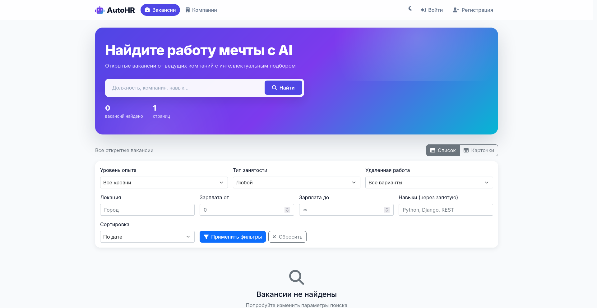
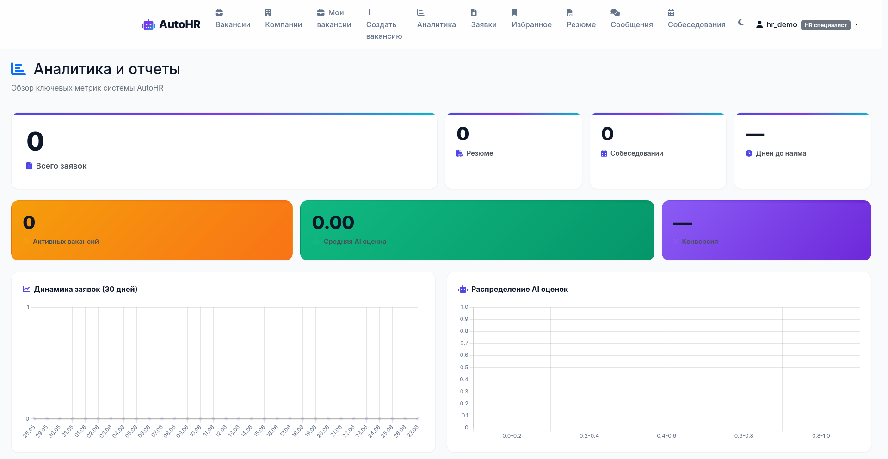
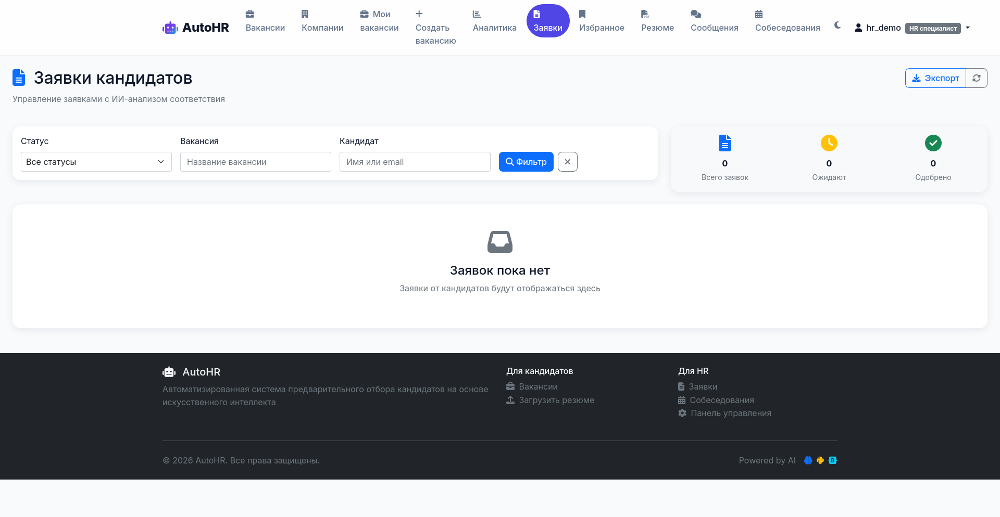
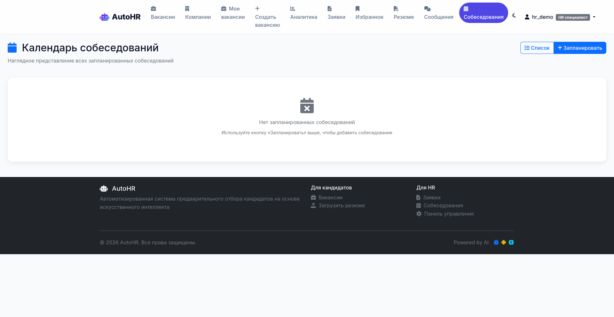
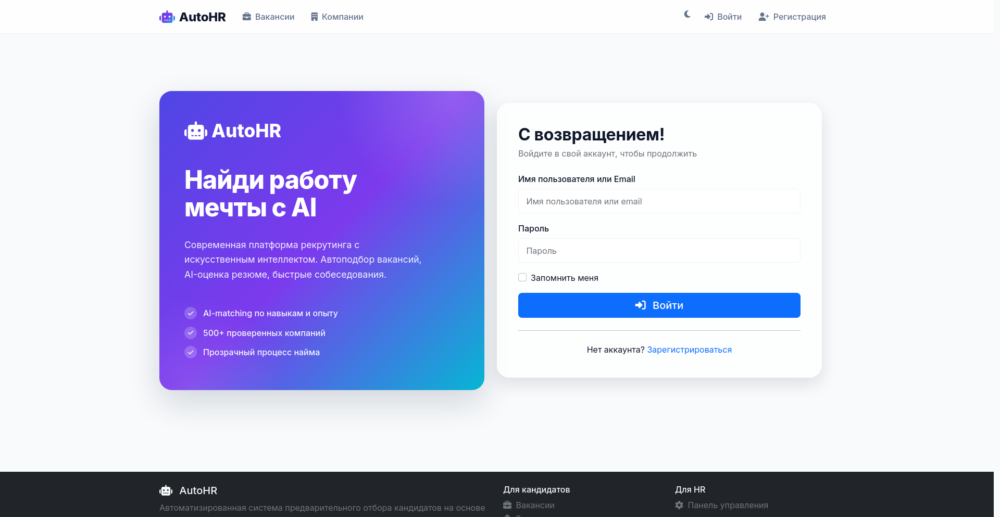
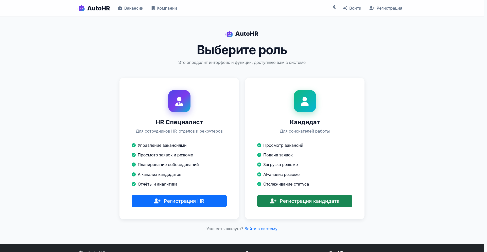

# AutoHR 🤖

Платформа для автоматизации найма с ИИ-анализом резюме, чатом между HR и кандидатами, расширенной аналитикой и поиском вакансий.


---

## Что это

AutoHR — это веб-приложение для HR-отделов и соискателей. Платформа объединяет классификацию вакансий, AI-скоринг кандидатов, чат между участниками процесса найма и аналитику воронки рекрутинга в одном продукте.

Система поддерживает два типа пользователей: **кандидаты** ищут работу, загружают резюме и общаются с HR; **HR-специалисты** публикуют вакансии, обрабатывают заявки, проводят собеседования и смотрят аналитику по всей воронке найма.

Главная особенность — **AI опциональный**. При разработке и тестировании движок отключается через переменную окружения, и платформа работает на лёгкой Null-реализации. При включении `AI_ENABLED=True` подключаются реальные модели для семантического поиска и оценки соответствия кандидата вакансии.

---

## Скриншоты

### Каталог вакансий с AI-поиском


### Аналитика воронки найма (HR)


### Управление заявками


### Календарь собеседований


### Аутентификация
| Вход | Регистрация |
|:---:|:---:|
|  |  |

---

## Возможности

### Кандидатам

- Расширенный профиль: опыт работы, образование, навыки с уровнями владения
- Поиск вакансий с фильтрами по навыкам, зарплате, типу занятости и локации
- Подача заявок с автогенерацией сопроводительного письма
- Загрузка резюме в формате PDF или DOCX с автоматическим извлечением данных
- AI-оценка соответствия резюме вакансии
- Избранное: отдельные вакансии плюс сохранённые поисковые запросы
- Чат с HR по конкретной заявке
- Отслеживание статуса заявок в реальном времени без перезагрузки страницы

### HR-специалистам

- Создание и редактирование вакансий
- AI-скоринг кандидатов с обоснованием оценки
- Управление заявками: одобрение, отклонение, планирование собеседования
- Календарь собеседований с автоматическими напоминаниями по email
- Чат с кандидатами (без WebSocket — через лёгкий HTMX-поллинг каждые 3 секунды)
- Аналитика: воронка рекрутинга, конверсия по этапам, время до найма, топ работодателей
- Компании с логотипами, отзывами и рейтингом

### Для разработчиков

- Полностью на Django templates с HTMX — никакого vanilla JavaScript или `fetch()`
- Все формы работают через `hx-post`/`hx-get` с автоматической передачей CSRF-токена через `hx-headers`
- Rate-limiting без внешних зависимостей (логин, регистрация, отклики, чат)
- Health-checks для Docker и мониторинга (`/health/`, `/health/ready/`, `/health/live/`)
- CORS-middleware, включается через `CORS_ENABLED=True`
- Команда для автоматических бэкапов SQLite
- Mobile-first адаптивность: sticky-фильтры, bottom-nav, tap-targets не меньше 36 пикселей
- Все статические ресурсы self-hosted: Bootstrap 5, HTMX, Alpine.js, Chart.js, Font Awesome

---

## Быстрый старт

```bash
git clone https://github.com/ChayannFamali/AutoHR.git
cd AutoHR
python3 -m venv .venv
source .venv/bin/activate
pip install -r requirements.txt
python manage.py migrate
python manage.py createsuperuser
python manage.py runserver
```

После запуска откройте `http://localhost:8000` — каталог вакансий работает сразу, без необходимости подключать AI.

### Проверка работоспособности

```bash
# Health-check
curl -s http://localhost:8000/health/

# Тесты (136 тестов, проходят за ~70 секунд)
python manage.py test --keepdb

# Бэкап базы
python manage.py backup_db
```

---

## Технологический стек

| Слой | Технологии |
|---|---|
| Backend | Django 5.2, Python 3.12, Celery 5, Redis |
| База данных | PostgreSQL 15 в production, SQLite 3 для разработки |
| Асинхронные задачи | Celery с Redis в качестве broker, eager mode для тестов |
| AI и ML | sentence-transformers (multilingual-e5-base), spaCy, NLTK — все опциональны |
| Frontend | Django Templates, HTMX 1.x, Bootstrap 5, Font Awesome 6, Alpine.js |
| Графики | Chart.js для дашбордов |
| Документы | PyMuPDF, pdfplumber, python-docx, openpyxl, reportlab |
| Production | Gunicorn, WhiteNoise, Docker, Docker Compose |

### Архитектурные решения

- **AI опциональный через переменную `AI_ENABLED`**. При `False` используется `NullAnalysisEngine` без накладных расходов, при `True` подключается реальный движок. Ленивые импорты `sentence-transformers` (около 1 ГБ) и `spacy` (около 200 МБ) держат старт лёгким.
- **HTMX вместо WebSocket для чата**. Поллинг каждые 3 секунды проще в развёртывании и дешевле для MVP, чем полноценный WebSocket-сервер.
- **Cross-DB совместимость JSONField**. Поиск по JSONField использует синтаксис с кавычками `'"Python"'`, который работает одинаково в SQLite и PostgreSQL.
- **Без внешних библиотек для rate-limit, CORS и health-checks**. Лёгкие реализации в `core/`, которые легко читать и модифицировать.

---

## Структура проекта

```
AutoHR/
├── accounts/             # Пользователи, профили, аутентификация
├── core/                 # Бизнес-логика: вакансии, заявки, компании
├── ai_analysis/          # ИИ-движок (опциональный)
├── resume/               # Загрузка и обработка резюме
├── calendar_app/         # Собеседования
├── messaging/            # Чат
├── analytics/            # Воронка, конверсия, метрики
├── notifications/        # Email-уведомления
│
├── static/vendor/        # Bootstrap, HTMX, Chart.js, Font Awesome
├── templates/            # HTML-шаблоны и partials
│   ├── core/partials/    # Переиспользуемые фрагменты для core
│   ├── calendar_app/partials/
│   ├── partials/         # Универсальные переиспользуемые фрагменты
│   └── includes/         # navbar, footer
│
├── docs/                 # Документация
│   ├── ROADMAP.md        # История разработки
│   ├── adr/              # Architecture Decision Records
│   └── UI_REDESIGN_PROPOSAL.md
│
├── autohr/               # Django-настройки
├── backups/              # Бэкапы SQLite (исключены из git)
├── manage.py
├── requirements.txt
├── .env.example
├── dockerfile
├── docker-compose.yml
└── README.md
```

---

## Конфигурация

Скопируйте `.env.example` в `.env` и заполните переменные:

```bash
# Режим работы
DEBUG=True
SECRET_KEY=change-me
ALLOWED_HOSTS=localhost,127.0.0.1

# База данных
DATABASE_URL=sqlite:///db.sqlite3
# Для production:
# DATABASE_URL=postgresql://autohr:autohr@db:5432/autohr

# AI (опционально, требует ~1.2 ГБ RAM)
AI_ENABLED=False

# CORS (для разделения frontend и backend)
CORS_ENABLED=False
# CORS_ALLOWED_ORIGINS=https://my-frontend.com
# CORS_ALLOW_CREDENTIALS=True

# Бэкапы
BACKUP_DIR=/var/backups/autohr
```

---

## Тестирование

```bash
# Все тесты
python manage.py test --keepdb

# С coverage
pip install coverage
coverage run --source='accounts,core,messaging,calendar_app,calendar_app' manage.py test
coverage report
```

Покрытие включает критические пути пользователей, поиск и фильтрацию вакансий, чат между HR и кандидатами, аналитику, rate-limiting, health-checks и интеграцию с HTMX-partials.

---

## API endpoints

### Health-checks

| URL | Метод | Назначение |
|---|---|---|
| `/health/` | GET | Полная проверка (БД, cache, миграции) в формате JSON |
| `/health/db/` | GET | Только база данных, возвращает 200 или 503 |
| `/health/ready/` | GET | Readiness probe |
| `/health/live/` | GET | Liveness probe |

Пример ответа `/health/`:

```json
{
  "status": "ok",
  "checks": {
    "database": {"status": "ok", "vendor": "sqlite"},
    "cache": {"status": "ok"},
    "migrations": {"status": "ok"}
  },
  "version": "dev",
  "python": "3.12.3"
}
```

### HTMX-эндпоинты

Все возвращают HTML-фрагменты для `hx-swap`, а не JSON:

| URL | Метод | Назначение |
|---|---|---|
| `/jobs/htmx/` | GET | Список вакансий с фильтрами |
| `/jobs/<id>/toggle-save/` | POST | Добавить или убрать из избранного |
| `/applications/<id>/update-status-htmx/` | POST | Одобрить или отклонить заявку |
| `/applications/<id>/detail-htmx/` | GET | Модальное окно с деталями |
| `/applications/<id>/schedule-htmx/` | POST | Спланировать собеседование |
| `/applications/<id>/add-note-htmx/` | POST | Добавить HR-заметку |
| `/jobs/<id>/delete-htmx/` | POST | Удалить вакансию |
| `/interviews/<id>/update-status-htmx/` | POST | Изменить статус собеседования |
| `/interviews/<id>/reschedule-htmx/` | POST | Перенести собеседование |
| `/interviews/<id>/feedback-htmx/` | POST | Сохранить отзыв после собеседования |
| `/messages/<id>/send/` | POST | Отправить сообщение в чате |
| `/messages/<id>/poll/` | GET | Поллинг новых сообщений |

### Rate-limits

| Действие | Лимит | Период | Ключ |
|---|---|---|---|
| Логин | 10 | 1 минута | по IP |
| Регистрация HR | 5 | 5 минут | по IP |
| Регистрация кандидата | 5 | 5 минут | по IP |
| Отклик на вакансию | 10 | 1 час | по пользователю |
| Одобрить или отклонить заявку | 30 | 1 минута | по пользователю |
| Начать переписку | 20 | 5 минут | по пользователю |
| Отправить сообщение | 60 | 1 минута | по пользователю |

При превышении лимита возвращается HTTP 429 с HTML-ошибкой или alert-бейджем для HTMX.

---

## Docker

```bash
# Полный стек: PostgreSQL + Redis + Django + Celery worker
docker compose up -d

# Только база данных для локальной разработки
docker compose up -d db

# Миграции и суперпользователь
docker compose exec web python manage.py migrate
docker compose exec web python manage.py createsuperuser
```

`docker-compose.yml` поднимает четыре сервиса:

- `db` — PostgreSQL 15
- `redis` — брокер для Celery
- `web` — Django + Gunicorn с настройками `autohr.settings_prod`
- `worker` — Celery worker для AI-очереди

---

## Лицензия

[MIT](LICENSE.md)

---

## Вклад в проект

Pull requests приветствуются. Для крупных изменений сначала откройте issue с описанием предложения.